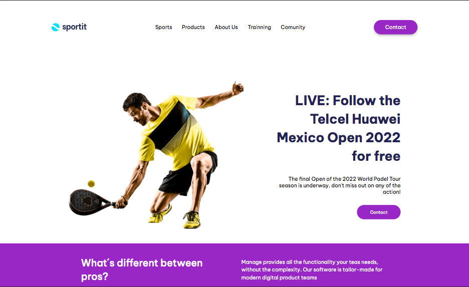

# Sportit

Esta es mi solución al examen práctico final del curso de Front End 1  🎾✨

## Resultado

### El reto
Su desafío es crear esta página de destino y hacer que se parezca lo más posible al diseño.

Sus usuarios deberían poder:

- Ver el diseño óptimo para el sitio según el tamaño de la pantalla de su dispositivo
- Los aspectos que tendremos en cuenta para la corrección serán los siguientes:
  - Estructura correcta de HTML
  - Uso y correcta implementación de etiquetas semánticas
  - Adaptabilidad a dos tipos de dispositivos
  - Correcta implementación del fomulario
  - Imagens, iconos, fuentes, background
  - Implementación de Flexbox
  - Buenas Practicas en el CSS
  - Pseudoelementos y Pseudoclases
  - (opcional) ---> Pequeñas animaciones

Puedes ver más información sobre el reto en la carpeta "guia", donde se encuentran las indicaciones, guía de estilos e imágenes del diseño.

### Links
- Código en Github: [Fátima Gallardo Examen Final FE1](https://github.com/FatimaGR/Fatima-Gallardo-Examen-Final-FE1)
- Live Site URL: 